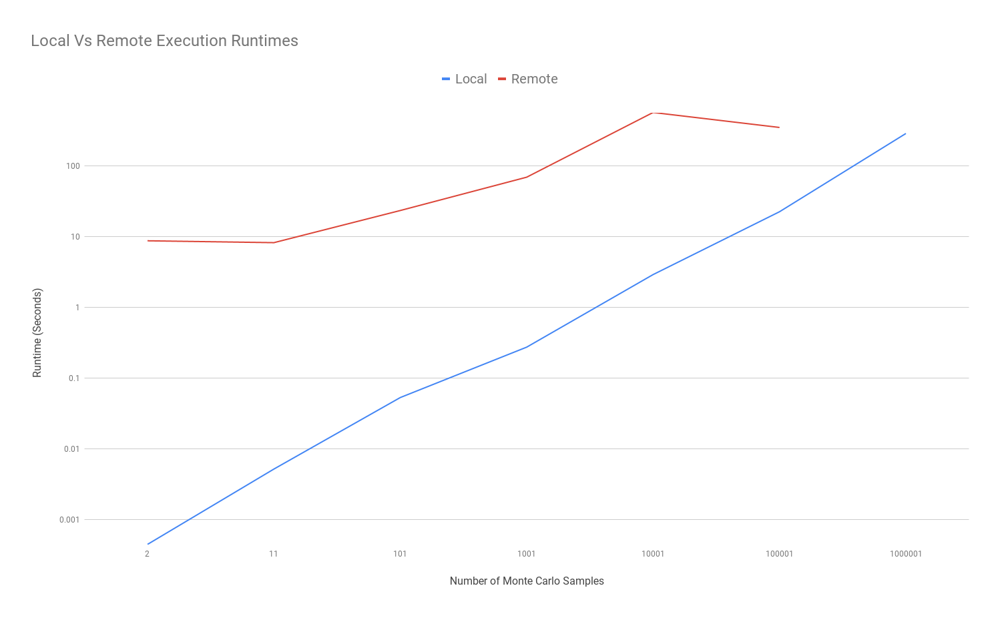

# DMCTS (Distributed Monte Carlo Tree Search)

This software system provides libraries and Docker base images to implement a Monte Carlo Tree Search that can be distributed and run on AWS Lambda instances. Examples are provided for docker runtime images (Lambda.Dockerfile), application deployment via AWS CloudFormation ('deploy' directory), as well as a fully implemented example/benchmark in the ./examples/dmcts-knapsack directory.

## dmcts-encoding
The DMCTS Encoding library provides an interface for communicating with dmcts-runtime instances. For library details, see the dmcts-encoding README.

## dmcts-runtime
The DMCTS Runtime provides simple, easy to use functions for deploying DMCTS runtimes in fewer than 15 lines of Haskell. See ./examples/dmcts-knapsack/runtime/Main.hs for an example.

## examples/dmcts-knapsack
As an example and a proof of concept, I've implemented a greedy Monte Carlo search for the knapsack problem using the DMCTS suite. Once built, the client can be run by navigating to ./scripts/bin-scripts/ and running ./dmcts-knapsack-client. The client has single solution collection, with the ability to run sampling both locally and remotely, as well as a Criterion based benchmarking mode. Thanks to the use of optparse-applicative, the executable also provides documentation when passed a standard --help argument.

## Deployment Instructions
The included makefile and shell scripts deploy the dmcts-knapsack example by building the docker image locally, pushing it to an AWS ECR repository, then deploying a CloudFormation stack (deploy directory) that builds both the AWS Lambda instance for our code, as well as an API endpoint to command it. 

#### Tools:
To build and deploy the dmcts-runtime, we use stack, docker, and the aws CLI tool.

Users should be able to deploy their own version of dmcts-knapsack with the following steps:
 1. Update the ECR URL to a repository belonging to the user. The ECR URL should be updated in:
	* The ./scripts/refresh-credentials script, if you use it (used to authenticate docker with the user's ECR)
 	* The Makefile: ./Makefile
	* The CloudFormation template: ./deploy/dmcts-knapsack/template.yaml
 2. Authenticate Docker with the newly configured ECR (see ./scripts/refresh-credentials)
 3. Run a 'make knapsack' to build and deploy the dmcts-knapsack runtime to the configured ECR
 4. Inside './deploy', run the 'deploy' script specifying 'dmcts-knapsack' as the stack name. This ought to select the proper template and deploy the lambda and the API endpoint.
 5. Once the API endpoint is deployed, view its URL through the AWS dashboard, or run a manual http-dmcts-command (located in ./scripts/manual-tests/dmcts-knapsack/http) to determine the URL.
 6. ./test_files/lambda-cfg.json should be created based on the template ./test_files/lambda-cfg.json.example, with the above URL in the URL field
 	1. Initial testing has found that a good per-lambda sample count is approx 5000. This seems to sidestep most timeout issues, while keeping the number of lambda instances fairly reasonable.

## Performance Implications
Due to the relative fragility of our remote execution, benchmarking efforts resulted in multiple hours-long runs failing in their final stretches. I suspect that the benchmark suite's behavior of running multiple high sample count executions back-to-back exceeded the quotas allotted to my AWS Lambda account, causing timeouts. These raw reports can be found in ./scripts/bin-scripts/samps. Because of this, it's difficult to come to any rigorous performance conclusions, though the partial data returned by the benchmark, combined with some manual testing, gives us a good idea as to the performance of local vs remote execution. The following data was collected from Run 3:

As we can see, we pay a severe time penalty for remote execution, though our testing seems to indicate that it parallelizes better than local execution (I'd hope it would!). Manual testing would seem to indicate that the break-even point comes with large sample sizes, on the order of 1-10 million, though this was never confirmed in a benchmark because of the aforementioned timeout issues.

## Future Work
The library works well, though there's plenty of space for refinement.
 * HTTP calls should be retried, as their current implementation is a little fragile.
 * Error messages could stand to be a little more friendly, several are just bare fromJusts.
 * There should be functionality to limit the number of in-flight lambda requests, as that seems like it'd fix some of the timeout issues experienced when we sample in excess of about 3 million samples remotely. 
 * When offloading the calculations to a remote server, we suffer a substantial time penalty, and I suspect we lose out on some ghc-provided memoization by splitting the sampling between instances. A better scheme might be to segment specific subtrees to node, so we can minimize overlap.
